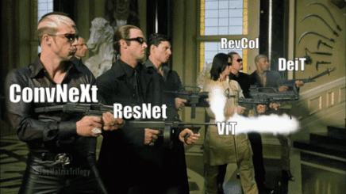
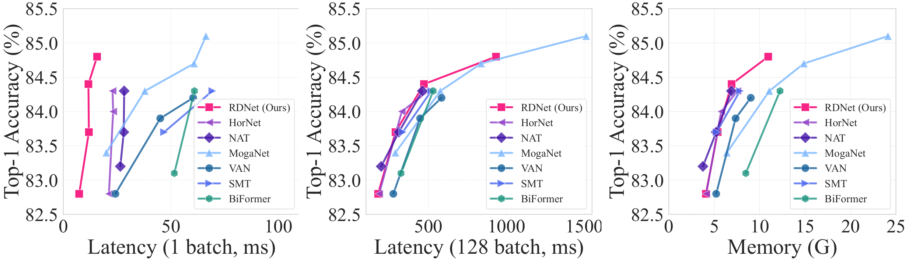
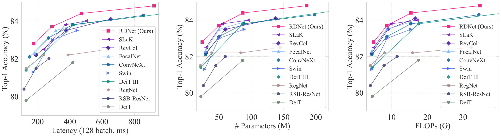

<div align="center">
<h3> 🎉🎉 Our paper has been accepted at ECCV 2024! Stay tuned for more updates !! 🎉🎉 </h3>

<h2><a href="https://arxiv.org/abs/2403.19588">DenseNets Reloaded: Paradigm Shift Beyond ResNets and ViTs</a></h2>

[Donghyun Kim](https://scholar.google.co.kr/citations?hl=en&user=EBC8BMAAAAAJ)<sup>1*</sup>, [Byeongho Heo](https://sites.google.com/view/byeongho-heo/home)<sup>2</sup>, [Dongyoon Han](https://dongyoonhan.github.io/)<sup>2*</sup>

<sup>1</sup><a href="https://www.ncloud.com/">NAVER Cloud AI</a>, <sup>2</sup><a href="https://naver-career.gitbook.io/en/teams/clova-cic/ai-lab">NAVER AI Lab</a>
</div>

<p align="center">
<a href="https://arxiv.org/abs/2403.19588" alt="arXiv">
    </a>
<a href="https://github.com/naver-ai/rdnet/blob/main/LICENSE" alt="license">
    </a>
<a href="https://huggingface.co/naver-ai" alt="Huggingface">
    </a>
</p>
    
<p align="center">
  
  
</p>

We revitalize **Densely Connected Convolutional Networks (DenseNets)** and reveal their untapped potential to challenge the prevalent dominance of ResNet-style architectures. Our research indicates that DenseNets were previously underestimated, primarily due to conventional design choices and training methods that underexploited their full capabilities.


<br>


*<p align="center">Tradeoff with RDNet (ours) and SOTA models</p>*

<br>


*<p align="center">Tradeoff with RDNet (ours) and mainstream models</p>*

### Key Highlights:
- Pilot study (**§5.1**) reveals *concatenations' effectiveness*.
- We have meticulously *upgraded various aspects of DenseNets* (**§3.2**) through architectural tweaks and block redesigns.
- Our revitalized DenseNets (**RDNets**) *outperform mainstream architectures* such as Swin Transformer, ConvNeXt, and DeiT-III (**§4.1**).

Our work aims to reignite interest in DenseNets by demonstrating their renewed relevance and superiority in the current architectural landscape. We encourage the community to explore and build upon our findings, paving the way for further innovative contributions in deep learning architectures.

*We believe that various architectural designs that have been popular recently would be combined with dense connections successfully.*

## Easy to use
Install rdnet package with `pip install rdnet` !

```python
import timm
import rdnet  # this will register the RDNet models to timm

model = timm.create_model('rdnet_large', pretrained=True)
```

For detailed usage, please refer to the [huggingface model card](https://huggingface.co/naver-ai/rdnet_tiny.nv_in1k).

## Updates
- **(2024.07.24)**: Pip installable pacakge added.
- **(2024.04.19)**: Initial release of the repository.
- **(2024.03.28)**: Paper is available on [arXiv](https://arxiv.org/abs/2403.19588).

## Coming Soon
- [ ] More ImageNet-22k Pretrained Models.
- [ ] More ImageNet-1k fine-tuned models.
- [x] Cascade Mask R-CNN with RDNet.
- [ ] Transfer Learning with RDNet (with cifar10, cifar100, stanford cars, ...).

## RDNet for Image Classification
For details on object detection and instance segmentation, please refer to [detection/README.md](detection/README.md).

For details on semantic segmentation, please refer to [segmentation/README.md](segmentation/README.md).


### Model Zoo
We provide the pretrained models for RDNet. You can download the pretrained models from the links below.

#### ImageNet-1K (pre-)trained models
|  Model  | IMG Size | Params | FLOPs | Top-1 | Model Card                                                         |                             url                              |
|:-------:|:--------:|:------:|:-----:|:-----:|--------------------------------------------------------------------|:------------------------------------------------------------:|
| RDNet-T |   224    |  22M   | 5.0G  | 82.8  | [model_card](./resources/hfhub_model_cards/rdnet_tiny.nv_in1k.md)  | [HFHub](https://huggingface.co/naver-ai/rdnet_tiny.nv_in1k)  |
| RDNet-S |   224    |  50M   | 8.7G  | 83.7  | [model_card](./resources/hfhub_model_cards/rdnet_small.nv_in1k.md) | [HFHub](https://huggingface.co/naver-ai/rdnet_small.nv_in1k) |
| RDNet-B |   224    |  87M   | 15.4G | 84.4  | [model_card](./resources/hfhub_model_cards/rdnet_base.nv_in1k.md)  | [HFHub](https://huggingface.co/naver-ai/rdnet_base.nv_in1k)  |
| RDNet-L |   224    |  186M  | 34.7G | 84.8  | [model_card](./resources/hfhub_model_cards/rdnet_large.nv_in1k.md) | [HFHub](https://huggingface.co/naver-ai/rdnet_large.nv_in1k) |

#### ImageNet-1K fine-tuned models

|     Model     | fine-tune from | IMG Size | Params | FLOPs  | Top-1 | Model Card                                                                     |                                   url                                    |
|:-------------:|:--------------:|:--------:|:------:|:------:|:-----:|--------------------------------------------------------------------------------|:------------------------------------------------------------------------:|
| RDNet-L (384) |    RDNet-L     |   384    |  186M  | 101.9G | 85.8  | [model_card](./resources/hfhub_model_cards/rdnet_large.nv_in1k_ft_in1k_384.md) | [HFHub](https://huggingface.co/naver-ai/rdnet_large.nv_in1k_ft_in1k_384) |


### Training
We provide the graphs of the training procedure. The graph is generated by the Weights & Biases service. You can check the graph by clicking the link below.

https://api.wandb.ai/links/dhkim0225/822w2zsj

For training commands, please refer to the [TRAINING.md](TRAINING.md).


### Acknowledgement
This repository is built using the [timm](https://github.com/huggingface/pytorch-image-models), [MMDetection](https://github.com/open-mmlab/mmdetection), and [MMSegmentation](https://github.com/open-mmlab/mmsegmentation).

### Citation
```
@misc{kim2024densenets,
    title={DenseNets Reloaded: Paradigm Shift Beyond ResNets and ViTs}, 
    author={Donghyun Kim and Byeongho Heo and Dongyoon Han},
    year={2024},
    eprint={2403.19588},
    archivePrefix={arXiv},
}
```

### License

```
Copyright (c) 2024-present NAVER Cloud Corp.

Licensed under the Apache License, Version 2.0 (the "License");
you may not use this file except in compliance with the License.
You may obtain a copy of the License at

    http://www.apache.org/licenses/LICENSE-2.0

Unless required by applicable law or agreed to in writing, software
distributed under the License is distributed on an "AS IS" BASIS,
WITHOUT WARRANTIES OR CONDITIONS OF ANY KIND, either express or implied.
See the License for the specific language governing permissions and
limitations under the License.
```

### License for Dataset
ImageNet - ImageNet Terms of access, https://image-net.org/download

Images from ADE20K - ADE20K Terms of Use, https://groups.csail.mit.edu/vision/datasets/ADE20K/terms/

MS COCO images dataset - Creative Commons Attribution 4.0 License, https://viso.ai/computer-vision/coco-dataset/

